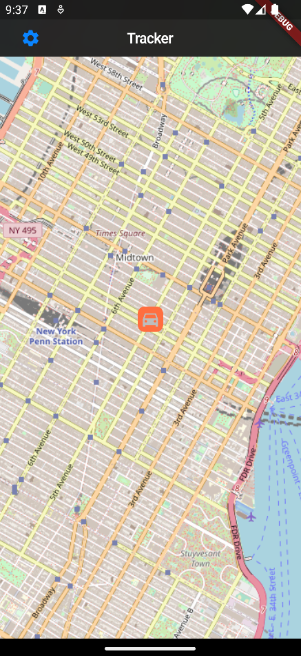
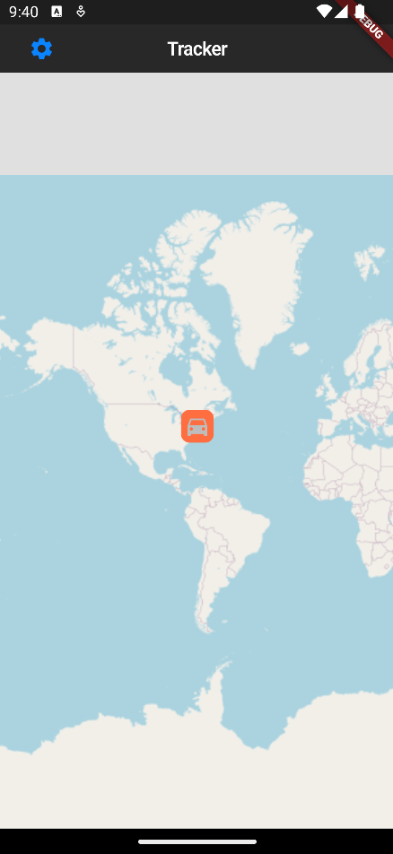
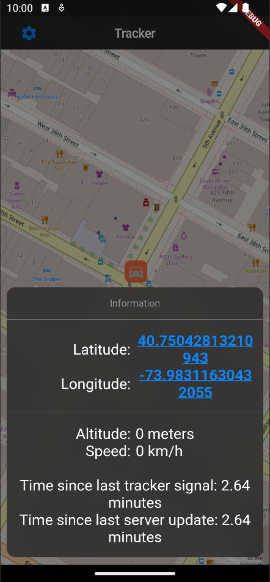
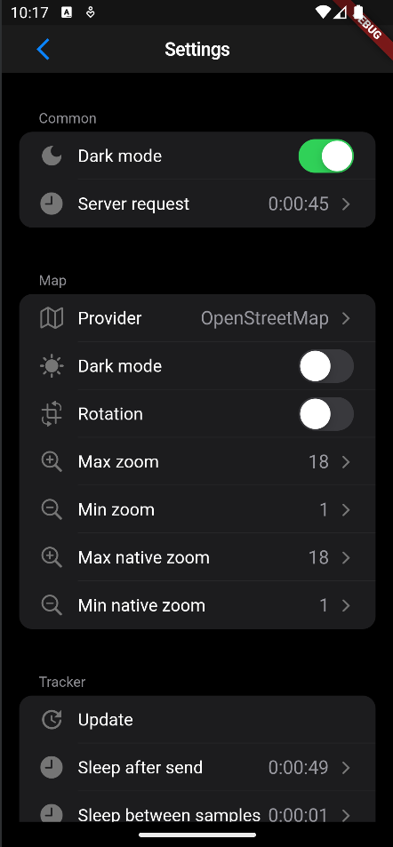

<p align="center">
    
</p>

# Minerva: Mobile App for Tracker Configuration and Navigation

Minerva is the mobile app designed for tracking and configuring your tracker through an intuitive interface. With Minerva, you can not only monitor your tracker's location on a dynamic map but also launch various navigation apps, such as Google Maps or Apple Maps, to set routes directly to the tracker.

# Overview
## Trackers Location on Dynamic Map

<table><tr>
<td>  </td>
<td>  </td>
</tr></table>

## Extended Tracker Information

- Latitude
- Longitude
- Altitude
- Speed

<p align="center">
    
</p>

Click on either latitude or longitude to seamlessly redirect to your preferred navigation app on mobile and Google Maps on desktop.

## Settings

<p align="center">
    
</p>

Minerva allows you to modify all tracker settings directly from the app. This flexibility eliminates the need for recompiling and redeploying the app for every single configuration change, providing a seamless and efficient user experience.

# Build

If you aim to build the app for iOS without a developer account, follow the guidelines outlined in [building and installing an ios app without a developer certificate](#building-and-installing-an-ios-app-without-a-developer-certificate) after fullfilling the prerequisties.

## Prerequisites
Edit `lib/main.dart` on line `528` and replace the values with the IP address of your server (e.g., Raspberry Pi or ESP32) and the credentials set during the server setup.
``` dart
// server settings
static String serverIp = "192.168.178.90";
static String serverAuth = "login:1234";
```

## Compiling

``` bash
flutter pub get
```

``` bash
flutter build [platform]
```

## Supported platforms
- Windows
- Linux
- macOS
- Android
- ios


# Building and Installing an iOS App without a Developer Certificate

This guide will walk you through the steps to build and install an iOS app without the need for a developer certificate. Please follow these instructions carefully.

## Prerequisites

Before getting started, make sure you have the following:

1. [Sidestore](https://wiki.sidestore.io/guides/install.html): Download and install Sidestore to sideload the app.

2. If you encounter the error "Can't create a proxy server" when trying to add your app, follow these steps:

   - Uninstall Sidestore
  
   - Install Sidestore using the complex route via AltServer and manually create a pairing page.

   - After creating the pairing page, rename the `*.mobiledevicepairing` file to `ALTPairingFile.mobiledevicepairing`. (Refer to [SideStore/SideStore#482](https://github.com/SideStore/SideStore/issues/482))

   - Note: Using the nightly build of Sidestore may be required instead of the latest stable version.

## Compiling the App

1. Open your terminal and run the following command to compile the app:

   ```bash
   flutter build ios --no-codesign --release
   ```

## Installing the App

1. Go to `/build/ios/iphoneos/`. (Refers to [Stack Overflow answer](https://stackoverflow.com/a/71346336))

2. Create a folder named "Payload" (case sensitive).

3. Copy the `Runner.app` into the "Payload" folder.

4. Compress the "Payload" folder using the default .zip format by right-clicking "Compress Runner.app."

5. Rename the compressed `Payload.zip` to `Payload.ipa`.

6. Send the `.ipa` file to your iPhone using a method like email or iCloud. If you use AirDrop, **do not** rename the file before sending.

7. Open the Sidestore app on your iPhone.

8. Navigate to "Apps," click the plus sign (+), and add the app using the provided `.ipa` file.
